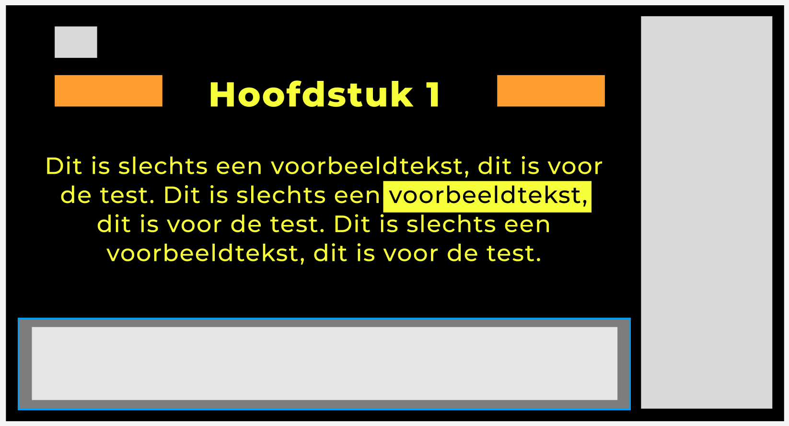
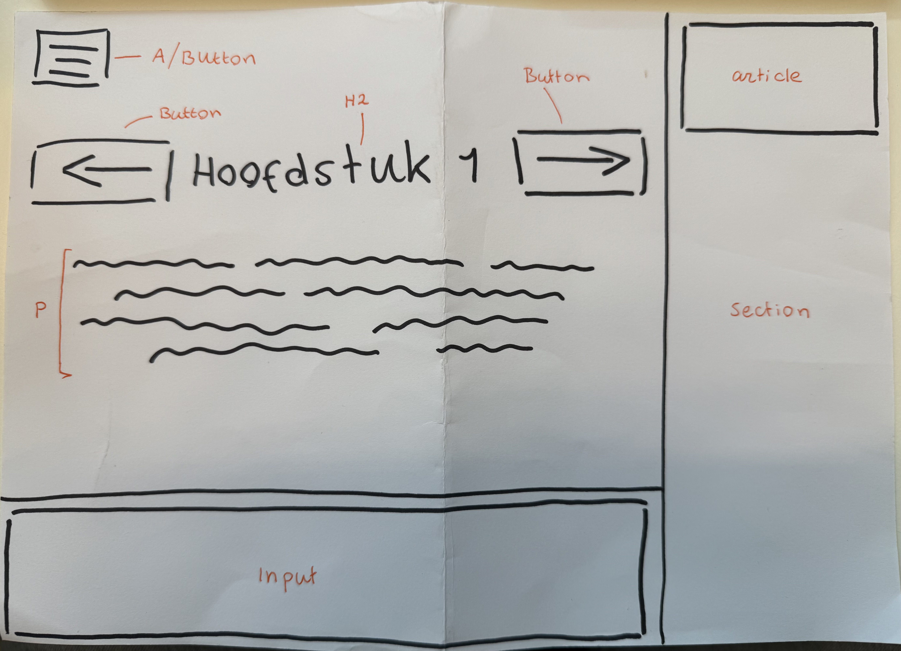
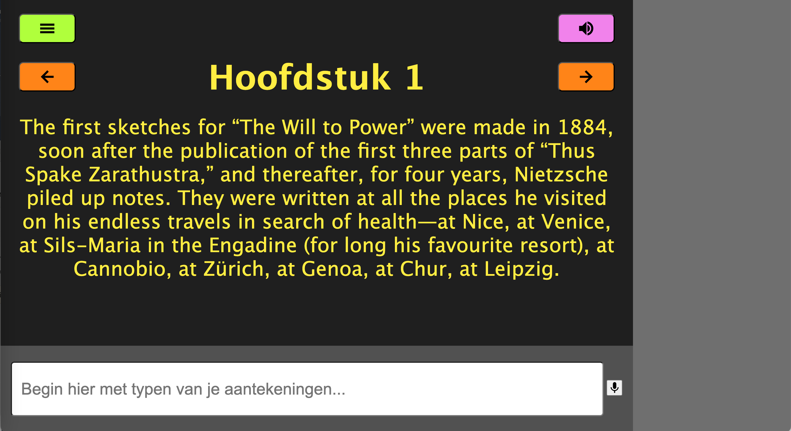

# HCD
## **📚 Week 1** 
In deze week kregen we de opdracht. Iedereen krijgt een persoon met een beperking toegewezen en je gaat specifiek voor deze persoon iets maken. Ik zit in groepje Roger, en roger heeft maculadegeneratie. Hij studeert op dit moment filosofie, en wil graag aantekeningen kunnen maken. Roger is op dit moment afhankelijk van een screenreader, hier moeten wij dus rekening mee houden.

De opdracht is dus om een webapplicatie te maken waarbij roger eenvoudig zijn filosofieboeken kan lezen en daarbij aantekeningen kan maken. 

Hij heeft vandaag aan ons verteld waar hij allemaal tegenaan loopt in het dagelijks leven, zodat wij aantekeningen konden maken van belangrijke factoren. Deze aantekeningen nemen we mee in ons eerste ontwerp. 

Een aantal van deze dingen zijn:
 - Tekst leest hij het prettigst als het geel op zwart is
 - Grote tekst kan hij nog enigzins prima zien
 - Hij kan ook nog gebruik maken van het toetsenbord

Dit zijn enkele dingen die ik uit de eerste kennismaking met roger heb kunnen halen. Ik heb nog niet echt een idee hoe ik het precies wil vormgeven, maar ik ga aan de slag. 

Op donderdag ben ik begonnen met het maken van een eerste opzetje, dit is waar ik als eerst mee ga testen: 

## **💻 Week 2**
Dit was de week van het testen. Roger komt naar school om onze eerste ontwerpen te proberen. Iedereen had zijn of haar website voorbereid om te gaan testen met Roger. Hij ging van links naar rechts het rijtje af en iedereen zijn laptop werd aangesloten op het bord zodat we allemaal goed mee konden kijken. Iedereen maakte aantekeningen en de tests werden gefilmd. Zelf heb ik de volgende aantekeningen kunnen halen uit de tests bij **andere**: 

- *Hij kan prima typen, duurt alleen iets langer.*
- *Hij wil naar boven in 1x, stelt ‘home -> end’ voor?*
- *Hij wil weten waar hij is, dus de toetsen voor laten lezen wanneer hij er overheen tabt.*
- *Meer dan 2 zinnen gaat hij niet meer lezen. Hou het dus simpel, 2 zinnen (grote tekst, lyrics video idee?)*
- *Hij typt met enters?*
- *Misschien wil hij een afbeelding toevoegen? Hoe hij het nu doet: hij maakt een foto van het beeld, dan plakt hij vervolgens deze afbeelding erin. Hij maakt nu een foto om iets te herinneren. Het hoeft niet alleen tekst te zijn, het mag ook een plaatje of iets.*
- *Het tempo van de screenreader is prima op medium snelheid.*
- *Krijg niet echt een duidelijk antwoord of hij het op zijn laptop of telefoon leest. Ik denk gewoon laptop.*
- *Grote muis cursor doen, een kleine muis ziet hij NIET, verder zo min mogelijk beweging met de muis.*
- *Snelheid screenreader aanpassen?*
- *Het aanpassen van grootte, snelheid, letterspacing vindt hij heel goed. Zeker doen dus.*
- *Hij vindt kleuren bij annotaties wel fijn.*
- *Hij ziet een highlight groot en in het midden van zijn scherm redelijk goed.*
- *Hij moet duidelijk kunnen zien dat het om een aantekening van hem gaat, het moet niet lijken alsof het bij de tekst hoort van het boek.*
- *Een border vindt hij prettig. Border gebruiken liever iets te groot dan iets te klein.*
- *De stem aanpassen misschien, vrouw, man, snelheid = nice to have.*
- *Snel naar verschillende hoofdstukken navigeren lijkt hem prettig (tab + hfdstk?)*
- *Container grootte aanpassen? Minder woorden tonen in de container wanneer deze kleiner is gemaakt?*
- *Tabben door zinnen vind hij goed.*
- *Verschil in kleur met titel en met tekst.*
- *Humor vind hij ook belangrijk.*

Tijdens de test kreeg ik eigenlijk een idee, het popte zo in mijn hoofd en ik begon gelijk een schets te maken nog voordat hij bij mij was aangekomen. Zo kon ik naast mijn website ook nog de schets laten zien aan hem en vragen wat hij hier van zou vinden. 

Tijdens mijn test met het eerste ontwerp, die website, snapte hij eigenlijk niet zo goed wat de bedoeling was. Ik had wat bepaalde letters aan knoppen gekoppeld, dat vond hij opzich wel geinig, maar hoe het precies werkte was niet helemaal duidelijk. 

Toen ik de schets liet zien was hij gelijk enthousiast! Ik wist wat me te doen stond, het oude ontwerp overboord gooien en volledig richten op het nieuwe ontwerp.

## **🧠 Week 3**
Deze week de ena-laatste test. Ik heb mijn schets uitgewerkt in een werkend prototype. Dit heb ik gedaan door eerst een schets te maken op papier en de elementen op te delen in bijvoorbeeld divjes, buttons of links. 

Hierdoor kon ik veel efficienter beginnen met coderen. Het ging veel sneller en ik kwam makkelijker bij mijn gewenste resultaat. Waar ik mee ging testen was het volgende:

 

Hij was weer super enthousiast! Wat mij een erg goed gevoel gaf. Mijn idee was om het minimalistisch te houden, niet hele lappe tekst toe te voegen en het eigenlijk kinderlijk eenvoudig te houden. Grote knoppen, felle kleuren en niet te veel poespas. Hij vond het echt heel goed en was er heel blij mee. Wat ik voor mijn laatste test volgende week nog wil doen is een record knopje toevoegen en misschien nog dat je kan tabben door de hoofdstukken

## **🎯 Week 4**

